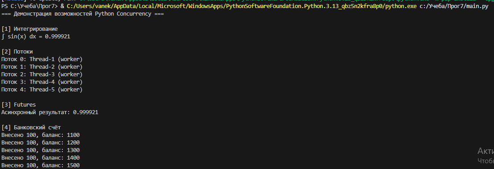

# Лабораторная работа №1  

Лабораторная работа по теме **многопоточности, параллелизма и асинхронности в Python**.

---

## Цели работы
- Изучение различных подходов к параллельному программированию
- Практическое сравнение потоков, процессов и asyncio
- Освоение стандартных инструментов Python для concurrency

---

## Содержание проекта
- Численное интегрирование
- Работа с потоками (`threading`)
- Использование `ThreadPoolExecutor` и `ProcessPoolExecutor`
- Синхронизация (Lock, Event, Barrier)
- Асинхронное программирование (`asyncio`, `aiohttp`)

---

## Результаты

