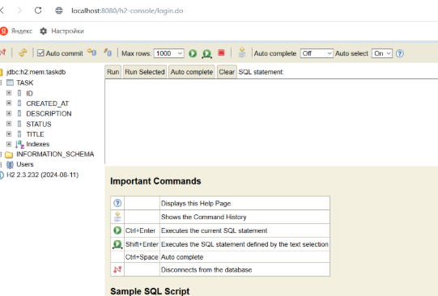

# Практическая работа №2  
## RESTful веб-приложение на Spring Boot — Task Management System

---

### Цель работы  
Создать RESTful веб-приложение для управления задачами с использованием Spring Boot, включая работу с базой данных, REST API и базовую безопасность.

---

### Выполненные этапы  

#### 1. Создание проекта  
- Проект создан с помощью **Spring Initializr** с параметрами:  
  - Maven, Java, последняя версия Spring Boot  
  - Зависимости: Spring Web, Spring Data JPA, H2 Database  
- Проект импортирован в IntelliJ IDEA.

#### 2. Настройка базы данных  
- В файле `application.yml` настроена база данных **H2** в режиме in-memory.  
- Включена консоль H2 для удобства тестирования.  
- Настроено автоматическое обновление схемы БД через `ddl-auto: update`.

#### 3. Создание модели задачи  
- Создан класс `Task` в пакете `model` с полями:  
  `id`, `title`, `description`, `status`, `createdAt`.  
- Использована аннотация `@Entity` и `@Data` от Lombok для автоматической генерации геттеров/сеттеров.

#### 4. Создание репозитория  
- Создан интерфейс `TaskRepository`, расширяющий `JpaRepository<Task, Long>`.

#### 5. Реализация REST контроллера  
- Создан `TaskController` с эндпоинтами для CRUD операций:  
  - `GET /api/tasks` — получить все задачи  
  - `POST /api/tasks` — создать задачу  
  - `PUT /api/tasks/{id}` — обновить задачу  
  - `DELETE /api/tasks/{id}` — удалить задачу

#### 6. Добавление безопасности  
- Добавлена зависимость `spring-boot-starter-security`.  
- Создан класс `SecurityConfig` с настройкой **HTTP Basic Authentication**.  
- Все эндпоинты защищены, логин и пароль заданы в памяти.

#### 7. Тестирование приложения  
- Проверены все CRUD операции через **Postman**.  
- Протестирована аутентификация:  
  - Без учётных данных — ошибка **401 Unauthorized**  
  - С логином/паролем — успешный доступ ко всем операциям  
- Данные проверены через консоль H2 (`/h2-console`).

---

### Результат  
- Полностью рабочее RESTful приложение для управления задачами.  
- Реализованы все требуемые функции: CRUD операции, безопасность, работа с БД H2.  
- Код чистый, структурированный, с использованием аннотаций Spring.

---

### Итоговый скриншот работы приложения  

---
