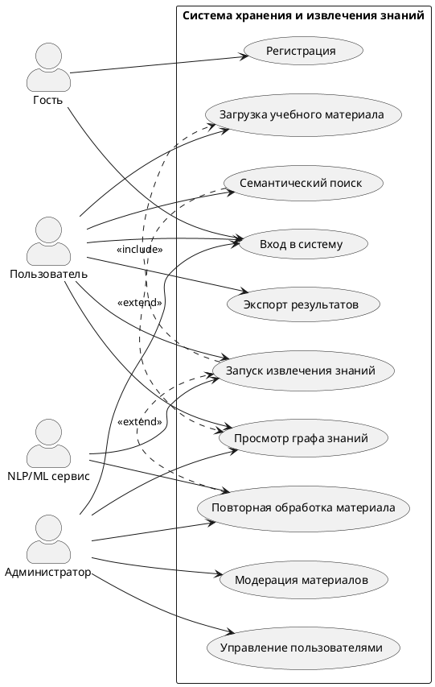
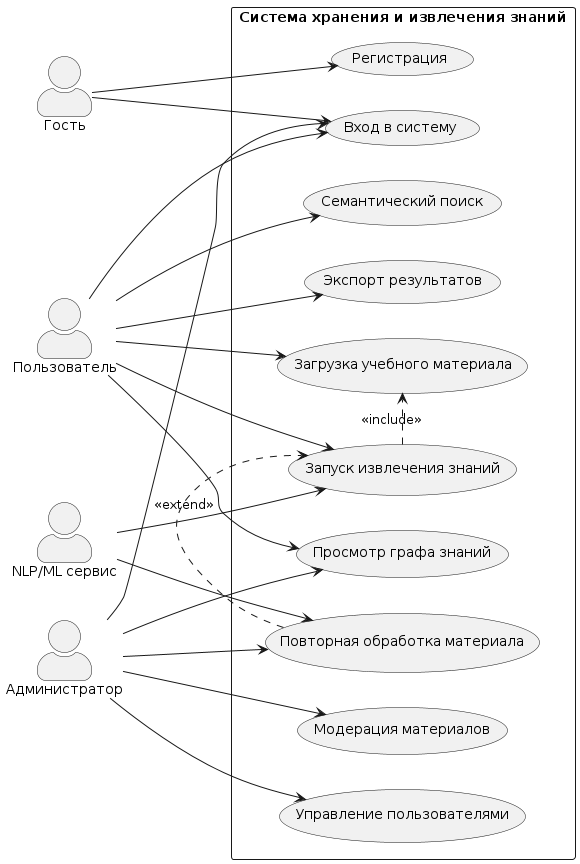
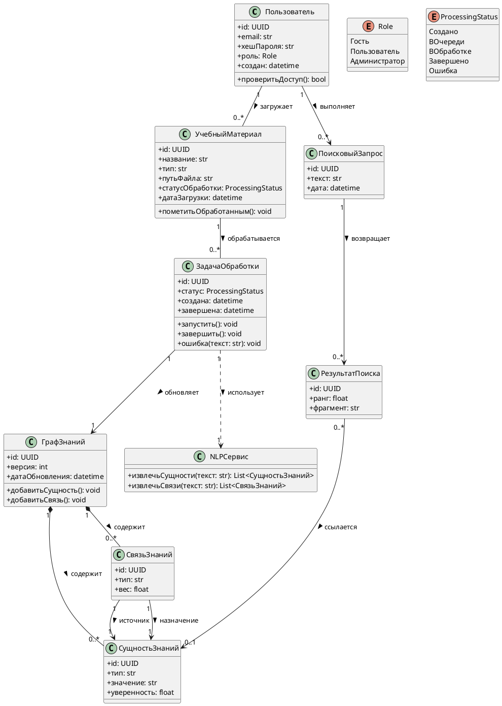
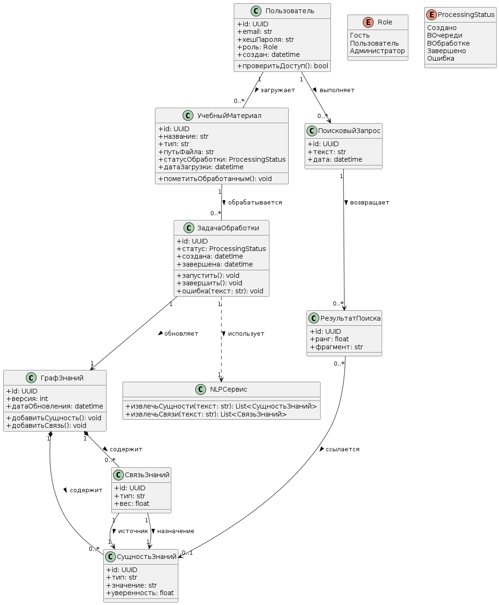
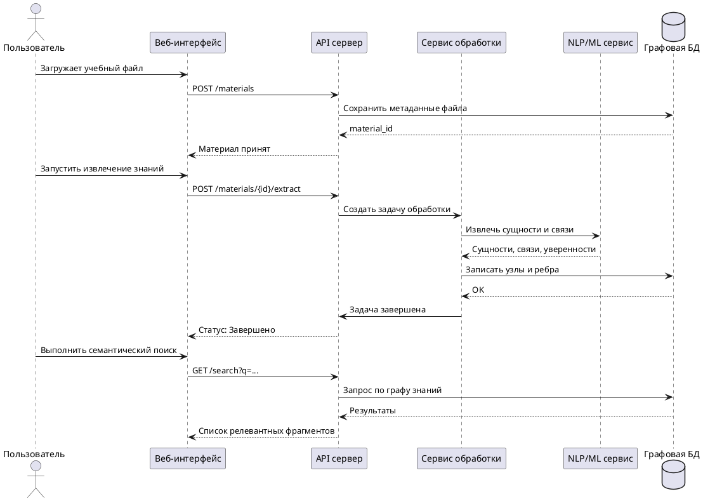
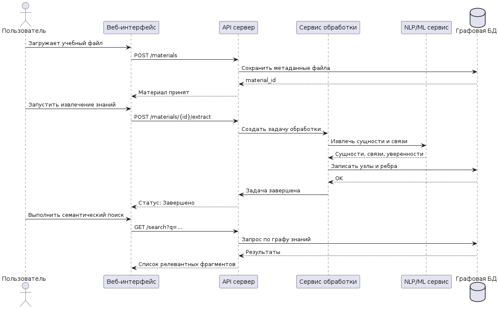
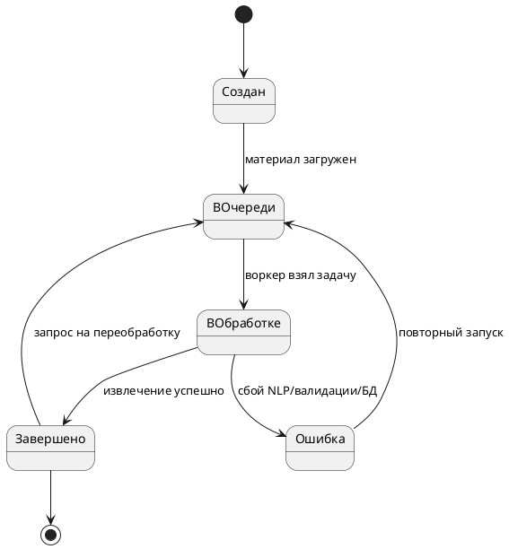
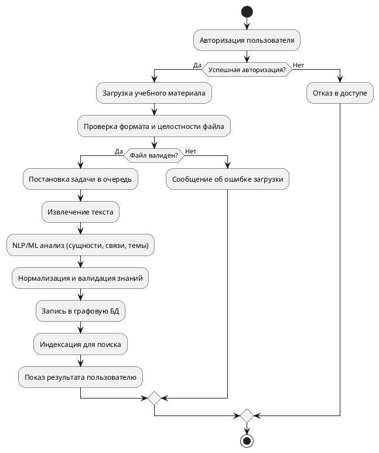

# Отчет по заданию: создание UML-диаграмм для ВКР

## Тема ВКР

**«Разработка системы хранения и извлечения знаний из учебных материалов на основе графовой базы данных.»**

## 1. Описание предметной области

Разрабатываемая система представляет собой веб-платформу для хранения и извлечения знаний из учебных материалов.  
Авторизованный пользователь загружает учебные документы (PDF, DOCX, презентации, текстовые файлы), после чего серверная часть выполняет интеллектуальную обработку содержимого: извлечение сущностей, терминов, связей, тем и фактов с использованием NLP/ML-подходов.

Извлеченные знания сохраняются в графовой базе данных в виде узлов и ребер. Это позволяет:

- выполнять семантический поиск по знаниям;
- выявлять связи между понятиями и источниками;
- ускорять доступ к релевантной учебной информации;
- повторно обрабатывать материалы при обновлении моделей;
- формировать структурированное представление предметной области.

Ключевая ценность системы состоит в преобразовании неструктурированных учебных материалов в структурированную сеть знаний, удобную для поиска, анализа и поддержки образовательного процесса.

## 2. Подход к выполнению задания


1. Определены основные роли пользователей и границы системы.
2. Выделены ключевые сущности предметной области и их связи.
3. Построены статическая и динамические модели системы:
   - диаграмма вариантов использования;
   - диаграмма классов;
   - диаграмма последовательности;
   - диаграмма состояний;
   - диаграмма деятельности.
4. Для диаграммы классов подготовлен программный код на языке **Python**.


---

## 3. Диаграмма вариантов использования (Use Case / Диаграмма прецедентов)





---

## 4. Диаграмма классов (Class Diagram / Диаграмма классов)





### 4.1 Программный код на Python для реализации модели классов

```python
from __future__ import annotations
from dataclasses import dataclass, field
from datetime import datetime
from enum import Enum
from typing import List, Optional
from uuid import UUID, uuid4


class Role(str, Enum):
    GUEST = "Гость"
    USER = "Пользователь"
    ADMIN = "Администратор"


class ProcessingStatus(str, Enum):
    CREATED = "Создано"
    QUEUED = "ВОчереди"
    RUNNING = "ВОбработке"
    DONE = "Завершено"
    ERROR = "Ошибка"


@dataclass
class User:
    id: UUID
    email: str
    password_hash: str
    role: Role
    created_at: datetime

    def has_access(self) -> bool:
        return self.role in {Role.USER, Role.ADMIN}


@dataclass
class LearningMaterial:
    id: UUID
    title: str
    file_type: str
    file_path: str
    status: ProcessingStatus
    uploaded_at: datetime
    owner_id: UUID

    def mark_done(self) -> None:
        self.status = ProcessingStatus.DONE


@dataclass
class KnowledgeEntity:
    id: UUID
    entity_type: str
    value: str
    confidence: float


@dataclass
class KnowledgeRelation:
    id: UUID
    relation_type: str
    weight: float
    source_entity_id: UUID
    target_entity_id: UUID


@dataclass
class KnowledgeGraph:
    id: UUID
    version: int
    updated_at: datetime
    entities: List[KnowledgeEntity] = field(default_factory=list)
    relations: List[KnowledgeRelation] = field(default_factory=list)

    def add_entity(self, entity: KnowledgeEntity) -> None:
        self.entities.append(entity)
        self.updated_at = datetime.utcnow()

    def add_relation(self, relation: KnowledgeRelation) -> None:
        self.relations.append(relation)
        self.updated_at = datetime.utcnow()


@dataclass
class ProcessingTask:
    id: UUID
    material_id: UUID
    status: ProcessingStatus
    created_at: datetime
    completed_at: Optional[datetime] = None
    error_message: Optional[str] = None

    def start(self) -> None:
        self.status = ProcessingStatus.RUNNING

    def finish(self) -> None:
        self.status = ProcessingStatus.DONE
        self.completed_at = datetime.utcnow()

    def fail(self, message: str) -> None:
        self.status = ProcessingStatus.ERROR
        self.error_message = message
        self.completed_at = datetime.utcnow()


class NLPService:
    def extract_entities(self, text: str) -> List[KnowledgeEntity]:
        # Заглушка: здесь может быть вызов модели NER/LLM
        return []

    def extract_relations(self, text: str) -> List[KnowledgeRelation]:
        # Заглушка: здесь может быть извлечение семантических связей
        return []


@dataclass
class SearchQuery:
    id: UUID
    user_id: UUID
    text: str
    created_at: datetime


@dataclass
class SearchResult:
    id: UUID
    query_id: UUID
    rank: float
    snippet: str
    entity_id: Optional[UUID] = None


if __name__ == "__main__":
    admin = User(
        id=uuid4(),
        email="admin@example.com",
        password_hash="hashed_password",
        role=Role.ADMIN,
        created_at=datetime.utcnow(),
    )
    print("Доступ администратора:", admin.has_access())
```

---

## 5. Диаграмма последовательности (Sequence Diagram / Диаграмма последовательности)





---

## 6. Диаграмма состояний (State Diagram / Диаграмма состояний)




---

## 7. Диаграмма деятельности (Activity Diagram / Диаграмма активности)




